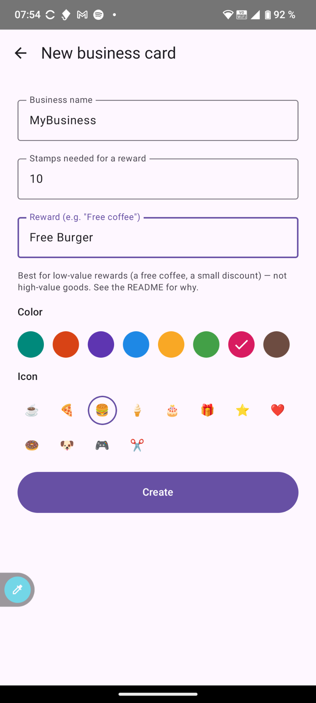
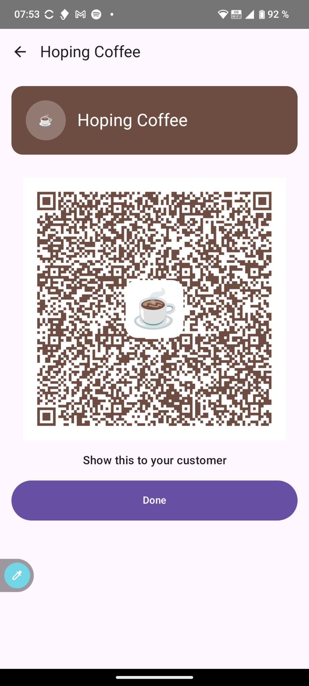
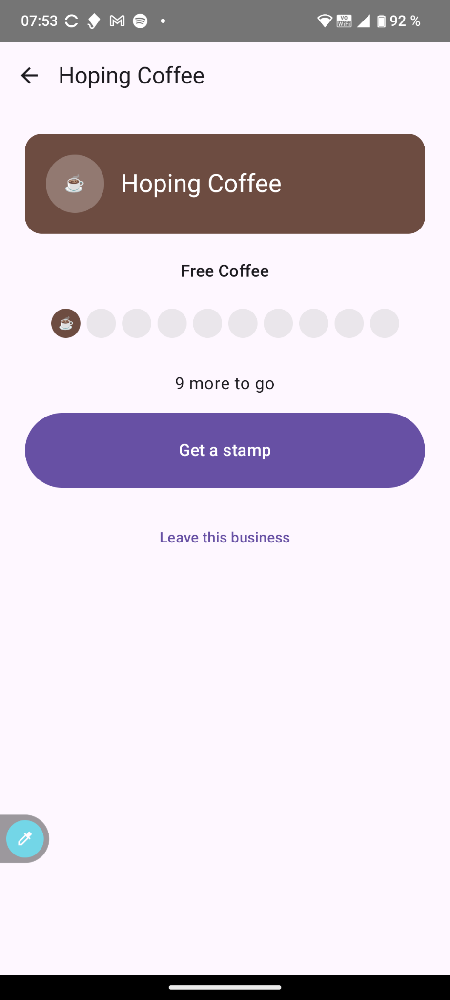

# Fidelity Card

[](https://github.com/lbruand/fidelity-card/actions/workflows/jvm-ci.yml)
[](https://github.com/lbruand/fidelity-card/actions/workflows/app-ci.yml)
[](LICENSE)
[](https://kotlinlang.org)
[](https://developer.android.com)
[](app/build.gradle.kts)
[](https://developer.android.com/jetpack/compose)

A FOSS Android app for loyalty stamp cards, exchanged entirely over QR
codes between two phones — no server, no account, no SaaS subscription.
One app plays both roles: **issuer** (a business awarding stamps) and
**collector** (a customer collecting them).

Every stamp is a unique, cryptographically signed token (Ed25519). Nobody
without a business's private key can forge one, and replaying an old QR
code is detectable by the collector's own app — see
[SPEC/SPECS.md](SPEC/SPECS.md) for the full protocol and threat model, and
[SPEC/CRYPTO_WIRE_FORMAT.md](SPEC/CRYPTO_WIRE_FORMAT.md) for the exact byte
format with test vectors, if you want to implement a compatible client on
another platform.

## Screenshots

<table>
<tr>
<td align="center" width="33%">
<br>
Issuer: create a business
</td>
<td align="center" width="33%">
<br>
Issuer: give a stamp
</td>
<td align="center" width="33%">
<br>
Collector: a card's progress
</td>
</tr>
</table>

## How it works

- **Issuer**: create a business card (name, stamps needed, reward). Giving
  a stamp is one tap — mint and show a signed QR, no scanning needed.
  Redeeming a reward is the one exchange that needs a reply: **"Scan a
  customer"** reads their redemption request and responds with a signed
  confirmation.
- **Collector**: scan whatever the business is showing — one scan does
  the right thing either way. Scanning a stamp for a business you haven't
  joined yet joins you *and* credits the stamp in the same step, so even
  a brand new customer's very first stamp is a single scan, no separate
  "join" step first. (Joining without buying anything, e.g. from a
  poster, still works too — that scan just skips the stamp.) Progress is
  shown as filled/empty dots, like a physical punch card. Once enough
  stamps are collected, claiming the reward is a show-a-QR →
  scan-their-reply exchange.

No Bluetooth, no Wi-Fi, no mobile data needed for any of it.

**Security note:** this is built for low-value loyalty rewards (a free
coffee, a small discount) — the same trust level as a paper punch card,
with cryptography added mainly to stop casual forgery. It is **not**
intended for high-value goods or payment-grade security: an issuer's
private key is stored as plain bytes in the app's private storage, not
hardware-backed via Android Keystore (see [SPEC/SPECS.md §2/§7](SPEC/SPECS.md)
for why, and what that does and doesn't protect against).

## Project layout

```
fidelity-card/
├── crypto/   pure Kotlin/JVM library — signing, verification, wire format
├── core/     pure Kotlin/JVM library — stamp/redemption business rules
├── backup/   pure Kotlin/JVM library — encrypted full-database backup/restore
└── app/      the Android app (Compose UI, Room, ZXing), depends on all three
```

`crypto`, `core` and `backup` have no Android dependency at all, so they
build and test with a bare JDK — no emulator, no SDK. That's deliberate:
it's what lets the protocol and business logic be verified in isolation,
and reused outside this app if someone wants to.

## Building

Requirements: JDK 17+ to build everything; the Android SDK only to build
`:app`.

```bash
# Library modules only - no Android SDK needed
./gradlew :crypto:test :core:test :backup:test

# The Android app (needs the Android SDK)
./gradlew :app:assembleDebug :app:testDebugUnitTest
```

## Status

Early, but functional: the protocol and its crypto/business-rule layers
(`:crypto`, `:core`, `:backup`) are implemented and tested, and the app
(`:app`) has been built, installed, and exercised end-to-end (issuing,
stamping, redeeming, backup/restore) on a real device in Android Studio.
Not yet submitted to F-Droid or any app store. See
[TODO.md](TODO.md) for what's tracked as still open, and
[SPEC/SPECS.md §11](SPEC/SPECS.md) for the spec's own open questions.

## License

[MIT](LICENSE)
